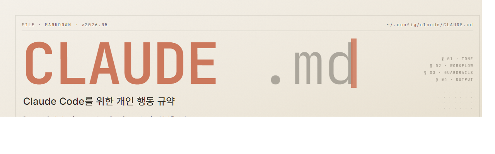

  

# CLAUDE.md

Claude Code 세션 시작 시 자동으로 동기화되는 개인 행동 규약 파일입니다.

## 사용 방법

로컬 `~/.claude/CLAUDE.md` 안에 세션 시작 동기화 규칙을 두면, 매 세션 첫 요청 시
이 저장소의 [CLAUDE.md](./CLAUDE.md)를 받아와 로컬 파일과 비교합니다. 차이가 있을 때만
diff를 보여주고 명시적 승인 후 덮어씁니다 — 무음 갱신은 하지 않습니다.

응답 스타일, 검증 규칙, 한국어 기본 등 세부 항목은 [CLAUDE.md](./CLAUDE.md)에 있습니다.

---

`Pull-only` · `Synced via WebFetch` · `seokjw0727/claudedotmd`
